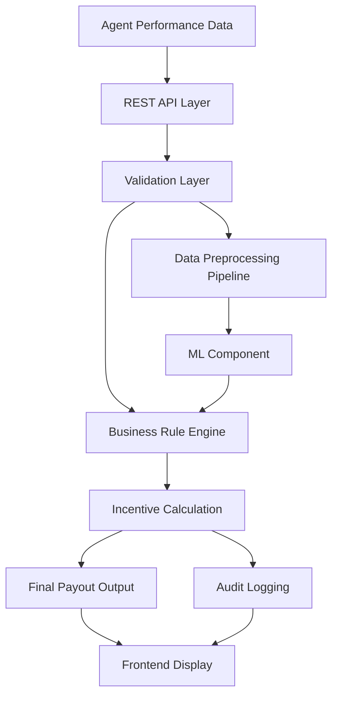

# 💼 Incentive Management Application (ICM)

A backend-heavy **enterprise incentive calculation system** designed to automate complex payout workflows for large-scale sales teams.

Built to replace **manual, error-prone spreadsheet processes**, this system delivers **accurate, auditable, and scalable incentive computations** using structured business rules, validation pipelines, and API-driven architecture.

---

## 🔥 Overview

Large organizations often calculate incentives manually — a slow and error-prone process that does not scale.

This project solves that by building a **production-style Incentive Calculation Management (ICM) system** that:

- Automates **agent payout calculations**
- Applies **complex business rules dynamically**
- Ensures **data validation before computation**
- Maintains **audit logs for transparency**
- Enforces **role-based access control (RBAC)**

---

## 🎯 Key Features

- ⚙️ Automated **incentive calculation engine** for agent payouts  
- 🔍 Robust **data validation layer** to prevent incorrect computations  
- 🧠 Business rule engine for **tier-based incentives & bonus logic**  
- 🔐 **Role-Based Access Control (RBAC)** for sensitive financial data  
- 📜 **Audit logging system** for complete traceability  
- 🔗 REST APIs for seamless frontend/backend communication  
- 🤖 Integrated **ML data pipeline** for AI-driven enhancements  

---

## 🧠 What Makes This Strong

- ✅ Real **enterprise client-style system (not a demo project)**
- ✅ Handles **complex conditional business logic**
- ✅ Focus on **data correctness + validation (critical in finance systems)**
- ✅ Demonstrates **backend architecture + API design + data pipelines**
- ✅ Integrates **ML pipeline into production workflow**

---

## 🛠️ Tech Stack

- **Backend:** Java, REST APIs  
- **Frontend:** React.js  
- **Database:** MySQL  
- **Architecture:** OOP, MVC  
- **Concepts:** RBAC, Audit Logging, Data Validation Pipelines  
- **AI Integration:** ML data preprocessing pipeline  

---

## ⚙️ Architecture



---

## 📸 Demo (Video)

🎥 Watch Project Demo:  
👉 https://drive.google.com/file/d/1OhfuFhitZUR5ycjY4ZEhIQQZSCOCPwQy/view?usp=sharing

---

## 🧱 Project Structure

```
src/
│── App.jsx                  # Main application entry
│── components/
│    ├── SearchForm.jsx      # Participant search & filters
│    ├── SearchResults.jsx   # Results wrapper
│    ├── ParticipantTable.jsx # Data table display
│── backend/
│    ├── api/                # REST API layer
│    ├── services/           # Business logic & rule engine
│    ├── validation/         # Input validation layer
│    ├── ml_pipeline/        # Data preprocessing for ML
│── database/
│    ├── schema.sql          # DB schema
```

---

## 🚀 Setup & Run

```bash
npm install
npm start
```

Open: http://localhost:3000

---

## ⚡ Real-World Problem Solved

Manual incentive calculation systems were:

- ❌ Slow (took days)
- ❌ Error-prone (incorrect payouts)
- ❌ Not auditable
- ❌ Not scalable for large teams (500+ agents)

---

## ✅ Solution Impact

- ⚡ Reduced manual effort through **automation**
- 📉 Minimized payout errors via **validation + rule enforcement**
- 🔍 Enabled **full auditability**
- 📈 Scaled to handle **large datasets & agent volumes**

---

## 🧩 Key Engineering Contributions

- Built **REST APIs in Java** for incentive workflows  
- Implemented **validation logic** to ensure clean input data  
- Developed **business rule conditions** for tier-based payouts  
- Designed **data preprocessing pipeline** for ML integration  
- Integrated ML outputs into **final payout calculation workflow**  

---

## 🧪 Key Challenge Solved

Handled **null bonus field issue** in incoming data:

- Prevented incorrect defaulting to zero  
- Implemented **API-level validation checks**  
- Fixed preprocessing logic to ensure **accurate payout calculations**  

---

## 🏁 One-Line Summary

> A production-style enterprise system that automates complex incentive calculations using backend APIs, business rule engines, and data pipelines with auditability and scalability.

